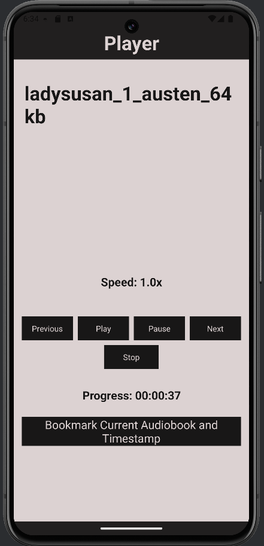
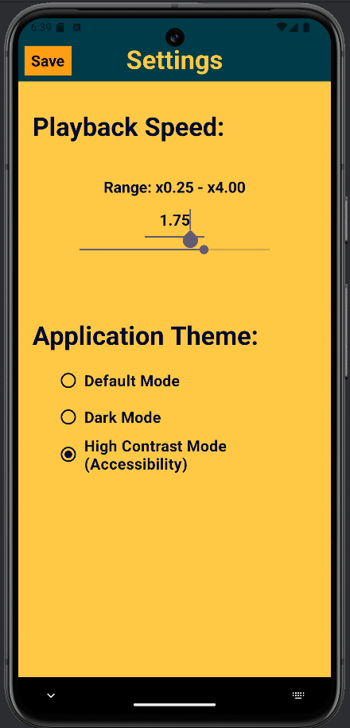

<a id="readme-top"></a>

<!-- PROJECT TITLE -->
# Audiobook Player

An audiobook player application project for Android OS.

<!-- TABLE OF CONTENTS -->
<details>
  <summary>Table of Contents</summary>
  <ol>
    <li>
      <a href="#about-the-project">About The Project</a>
      <ul>
        <li><a href="#built-with">Built With</a></li>
      </ul>
    </li>
    <li><a href="#usage">Usage</a></li>
  </ol>
</details>

<!-- ABOUT THE PROJECT -->
## About The Project

<p float="left">
    
    
</p>

This project is a full-stack mobile application specifically developed for Android devices to play local audiobook files.

The main goals of this project are:
1. Developing an Android-specific application with multiple activities, including a home activity, settings activity and audio player activity.
2. Implementation of Android Service to handles background playing.
3. Supporting appropriate navigation and management of components, alongside good architectural design.
4. Functionalities including setting playing speed, application theme, and bookmarking audiobook played time.

<p align="right">(<a href="#readme-top">back to top</a>)</p>

### Built With

* Java
* Gradle
* Android Studio

<p align="right">(<a href="#readme-top">back to top</a>)</p>

<!-- USAGE -->
## Usage

To run this project, download the ```app-debug.apk``` file from the *Final-Application* folder onto an Android device.

Alternatively, download the source code and use Android Studio and Kotlin to compile and run virtually on an emulator.

This application is specifically developed for and tested on a Pixel 5 device running Android 14 and Android API version 34. Deviation from these specifications may lead to unintended results. 

<p align="right">(<a href="#readme-top">back to top</a>)</p>